<table width="100%" border="0" cellspacing="0" cellpadding="0">
<tr>

<td width="40" valign="top">

</td>

<td valign="top" align="center">


<br>

[](https://git.io/typing-svg)

<br>

<a href="https://www.linkedin.com/in/bruno-mera-montiel"></a>
&nbsp;
<a href="mailto:bruno.mera@cunef.edu"></a>
&nbsp;


<br><br>

---


<br>

---

```
> cat interests.txt
```


---

```
> cat tech_stack.txt
```

<br>


<br><br>


<br><br>


<br>

---

```
> ls projects/
```


---

```
> git log --stats
```

<br>


&nbsp;


<br><br>


<br><br>


<br>

---


</td>

<td width="40" valign="top">

</td>

</tr>
</table>
