<div align="center">





<br>

[](https://git.io/typing-svg)

<br>

<a href="https://www.linkedin.com/in/bruno-mera-montiel">

</a>
&nbsp;
<a href="mailto:bruno.mera@cunef.edu">

</a>
&nbsp;


</div>

<br>

---

### `> whoami`

Final-year **Computer Science** student passionate about building things that matter.
Currently writing my thesis on **AI applied to railway interlocking systems** — where machine learning meets critical infrastructure.

I like clean code, minimal design, and solving problems that feel impossible at first.

<br>

---

### `> cat about.txt`

<div align="center">

</div>

<br>

---

### `> cat interests.txt`

<div align="center">

</div>

<br>

---

### `> cat tech_stack.txt`

<div align="center">

**languages**


<br>

**tools & platforms**


<br>

**frameworks**


</div>

<br>

---

### `> ls projects/`

<div align="center">

</div>

<br>

---

### `> git log --stats`

<div align="center">


&nbsp;


<br><br>


<br><br>


</div>

<br>

---

### `> neofetch`

```
BrunoMeraMontiel @ github
─────────────────────────
OS        →  final year, still compiling
Shell     →  curiosity-driven
Uptime    →  since 2002
Packages  →  Python, LaTeX, and whatever the project needs
Theme     →  minimal & monochrome
Terminal  →  always open █
```

<br>

<div align="center">

</div>
